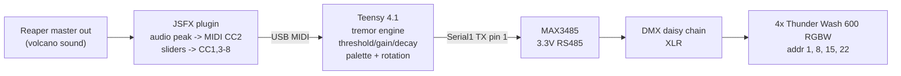
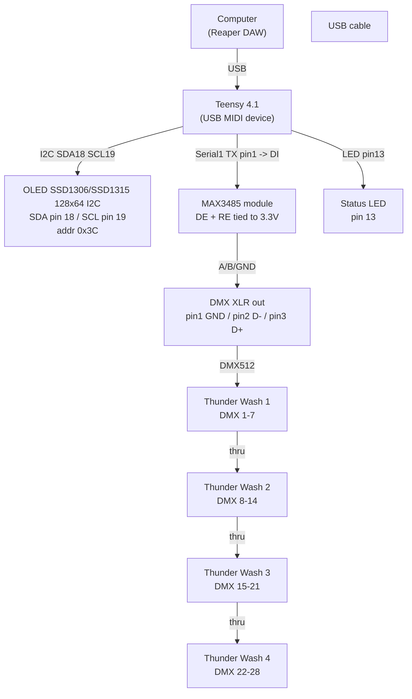
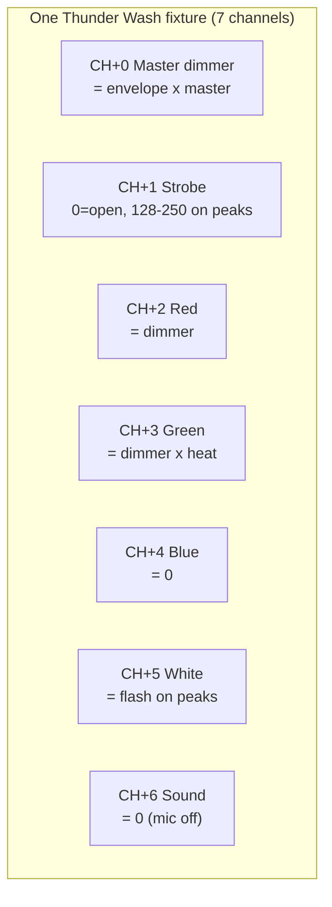

# RingoffireCC2DMX

Teensy 4.1 turns the **volcano sound from your Reaper master output** into a
ring-of-fire light tremor across **4x Cameo Thunder Wash 600 RGBW** fixtures.
Audio in, tremor out. A Reaper plugin converts the master level to MIDI CC;
the Teensy shapes that into DMX.

---

## Signal flow



---

## Hardware block diagram



### Pin / wiring table

| Function | Teensy 4.1 pin | Peripheral | Notes |
|---|---|---|---|
| DMX TX | 1 (Serial1 TX) | MAX3485 DI | transmit only |
| OLED SDA | 18 | SSD1306 | I2C data |
| OLED SCL | 19 | SSD1306 | I2C clock |
| Status LED | 13 | built-in | MIDI activity blink |
| MAX3485 DE, RE | tie to 3.3V | module | enables transmit |
| GND, 3.3V | - | all | common ground |

MAX3485 is 3.3V native ? correct for Teensy 4.1 (not 5V tolerant). Set each
Thunder Wash to **7-CH Mode_1**, start addresses **1, 8, 15, 22**.

### MAX3485 (RS-485) -> XLR wiring — **critical, get this right**

The most common wiring fault is swapping the differential pair. For a standard
3-pin XLR DMX output:

| MAX3485 module terminal | XLR pin | DMX signal |
|---|---|---|
| **A+** | **Pin 3** | Data + (true / non-inverted) |
| **B-** | **Pin 2** | Data - (complement / inverted) |
| **Ground / Shield** | **Pin 1** | Ground / shield |

> **A+ goes to XLR pin 3, B- to XLR pin 2.** If you swap them, the fixtures
> receive garbage and stay dark. Verified on the bench: A+ -> pin 3.

---

## The two pieces

### 1. Reaper plugin ? `reaper/ringoffire_audio2cc2.jsfx`

Place on a track that receives the master mix. Reads the audio peak and sends
MIDI CC to the Teensy. Install: copy to `%APPDATA%\REAPER\Effects\ringoffire\`
and add as a JS effect.

**Reaper routing (one-time):**
1. Preferences -> Audio -> MIDI Devices -> enable **Teensy MIDI** output.
2. Master track -> Route -> send audio to the plugin track.
3. Plugin track -> Route -> MIDI Hardware Output -> Teensy MIDI, channel 1.
4. Record-arm the track, **Record: disable (input monitoring only)**, monitoring ON.

**Sliders (each sends a CC on channel 1 when moved):**

| Slider | CC | Effect |
|---|---|---|
| Master brightness | CC1 | overall light level (0 = dark) |
| Threshold | CC3 | tremor only reacts above this |
| Gain | CC4 | reaction strength |
| Decay | CC5 | how fast light falls after a hit |
| Color heat | CC6 | deep red -> amber -> white-hot |
| Ring rotation | CC7 | tremor travels around the 4 heads (0 = in sync) |
| Peak strobe | CC8 | hardware strobe on hard peaks (0 = off) |
| Audio attack / release | - | envelope feel (tight <-> long rumble) |
| Noise floor / Full scale | - | dB window that maps to tremor 0-127 |

The plugin display shows the live audio bar, the tremor value sent, and 8 bars
(CC1..CC8) so you can verify what the Teensy should be receiving.

### 2. Teensy firmware ? `ringoffire_CC2DMX/ringoffire_CC2DMX.ino`

50 Hz tremor engine: instant attack + linear decay envelope, volcano palette,
per-fixture rotation from a 64-tick history buffer. Build with Arduino IDE +
Teensyduino, board **Teensy 4.1**, USB Type **Serial + MIDI**. Libraries:
Adafruit SSD1306, Adafruit GFX, TeensyDMX (qindesign).

Flash with the included script (reliable two-step):

```powershell
.\flash.ps1
```

## OLED display reference

**Module:** 0.96" 128x64 I2C OLED, SSD1306/SSD1315 driver, address `0x3C`,
**yellow top band (rows 0-15) + blue bottom band (rows 16-63)**.
Wired to SDA=pin 18, SCL=pin 19, powered 3.3V.

The display has two screens: a **splash** at boot, then the **live view**.

### Splash screen (first 3 s at boot)

```
+--------------------------------+
|         RINGOFFIRE             |  <- yellow band, size 2 title
|  ----------------------------  |
|      v1.1  2026-09-28          |  <- blue band: version + release date
|    Sep 28 2026 22:09:13        |  <- build timestamp (auto, exact)
|    Teensy 4.1  #5560969        |  <- board + git commit hash
+--------------------------------+
```

| Field | Meaning | Trust it? |
|---|---|---|
| `v1.1` | `FW_VERSION` define, bumped per release | manual |
| `2026-09-28` | `FW_DATE` define, release date | manual |
| `Sep 28 2026 22:09:13` | `BUILD_STAMP` = `__DATE__`+`__TIME__`, captured at compile | **exact** — proves the binary |
| `#5560969` | `FW_COMMIT` git short hash | **approximate** — always one commit behind (the hash can't know itself before commit) |

**Same info over USB serial** (115200 baud), machine-readable, so you or a
script can verify a deployed unit without reading the screen:

```
[FW] name=RingoffireCC2DMX
[FW] version=v1.1
[FW] date=2026-09-28
[FW] commit=5560969
[FW] build=Sep 28 2026 22:09:13
[FW] features=4xTW600 7ch | CC2 tremor | NO-MIDI alarm
[FW] fixtures=4
[FW] dmx_channels=28
```

> **Source of truth:** the build timestamp (`BUILD_STAMP` / `[FW] build=`) is
> always exact. `FW_VERSION`/`FW_DATE`/`FW_COMMIT` are manual and may lag.

### Live view (normal operation)

```
+--------------------------------+
| 41   RINGOFFIRE            100 |  <- yellow band: CC2 (left) | title | CC1 (right)
+--------------------------------+
|  __   __   __   __   |         |
| |  | |  | |  | |  |  | |||     |  <- blue band
| |##| |  | |# | |  |  | |||     |     F1-F4 bars (tremor)  |  CC1..CC8 mini strip
| |##| |# | |# | |# |  | |||     |
|  F1   F2   F3   F4   |         |
+--------------------------------+
```

| Element | What it shows |
|---|---|
| **CC2** (top-left) | raw tremor value arriving from Reaper (0-127) |
| **CC1** (top-right) | master brightness received (0-127); 0 = lights dark |
| **F1-F4 bars** | per-fixture tremor intensity (the 4 ring heads) |
| **CC mini strip** | live value of each control CC (CC1..CC8) |

### Live view (NO MIDI alarm)

If no mapped CC arrives for **>1.5 s**, the yellow band inverts to a solid
alarm banner:

```
+--------------------------------+
|########## NO MIDI #############|  <- inverted yellow band = ALARM
+--------------------------------+
|  __   __   __   __   |         |
| |  | |  | |  | |  |  |         |  <- bars keep last state (DMX still runs)
+--------------------------------+
```

This means: **Teensy is running but not receiving** — check the USB cable,
Reaper's MIDI routing, or the plugin. It is not a crash; DMX output continues.

---

## MIDI CC -> DMX reference

**MIDI (from plugin, channel 1):** CC1 master, CC2 tremor (audio),
CC3 threshold, CC4 gain, CC5 decay, CC6 heat, CC7 rotation, CC8 strobe.

**DMX per fixture (7-CH Mode_1, start addrs 1/8/15/22):**



Full fixture DMX table: `datasheets/CLTW600RGBW-dmx_control_table--D004114-en.pdf`.

---

## Current state & known issues (work in progress)

**Working:**
- Teensy 4.1 firmware: compiles, flashes, drives 4x Thunder Wash, splash screen
  with version/date/build/commit, NO-MIDI alarm banner, machine-readable serial
  identity (`[FW] ...` at 115200 baud).
- Reaper plugin receives audio and produces CC2 (tremor envelope) -> F1-F4
  react to the sound.
- Control CCs (CC1, CC3-CC8) are received by the Teensy.

**Known issues / open problems (to revisit):**
- **Control-CC reactivity is inconsistent.** Slider changes are sent from
  `@slider`, but Reaper only flushes them to the hardware while the track's
  MIDI is actively processed (during playback / armed+monitored). Result:
  slider changes can appear to lag until a transport state change. Needs a
  reliable always-on send path.
- **Envelope follower tuning is fragile.** Several DSP variants were tried
  (per-sample follower, peak-hold, block-RMS). The per-sample follower works
  but the response on sustained low-frequency rumble vs. transients is not
  fully satisfying. The RMS attempt had a coefficient bug (smoothing factor
  collapsed to ~0) and was reverted. Needs a clean, tested envelope design.
- **JSFX UI** is functional but plain; monitor bars show `CCn=value` per bar
  but the layout could be clearer about which slider maps to which bar.
- **Display geometry assumption:** the module is 128x64 (SSD1306/SSD1315) with
  a yellow top band (rows 0-15). Early code assumed 128x32 and looked jammed;
  fixed, but worth confirming on the final production unit's exact panel.

**Last known-good baseline:** git commit `37aef73` (plugin) — restored and
committed as the working reference.

---

## Files

- `ringoffire_CC2DMX/` ? Teensy 4.1 firmware
- `reaper/ringoffire_audio2cc2.jsfx` ? Reaper audio->CC plugin
- `OMR_DMX_TEST/` ? standalone hardware test: cycles all 4 fixtures through
  RED/GREEN/BLUE/WHITE/OFF with the step shown on the OLED. No MIDI/Reaper.
  Use it to verify wiring + addressing. Reflash the main firmware with
  `.\flash.ps1` afterward.
- `datasheets/` ? Thunder Wash DMX control table
- `flash.ps1` ? one-command Teensy flasher

## Credits

Firmware structure based on VertigoCC2DMX by RVX (Victor Mazon Gardoqui), MIT.
Libraries: Adafruit, qindesign (TeensyDMX).
